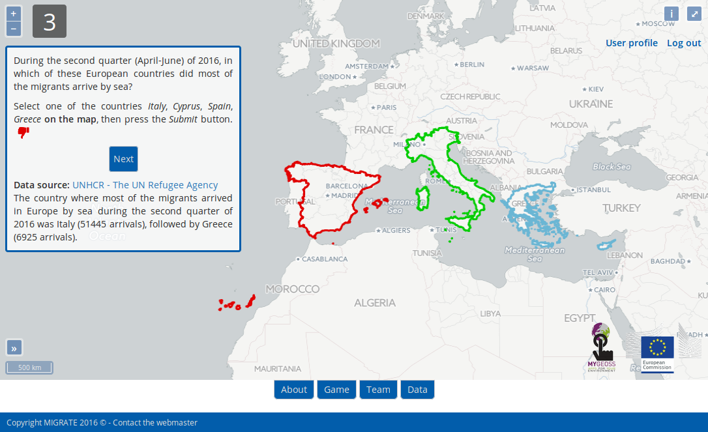

# MIGRATE - MIGRation pATterns in Europe

MIGRATE - MIGRation pATterns in Europe is a Web mapping application aimed at educating and raising awareness about the migration phenomenon in Europe. This goal is achieved using a gamification approach, i.e. users interact with the application by playing a map-based game, where questions are asked and answers are provided, about a number of topics related to migration. According to their answers, users are awarded with points and badges and are ranked publicly, which allows to keep them motivated in using the application further. Users' answers help to understand the current knowledge and perception of migration-related issues. Relevant publications can be found [here](http://www.patroneditore.com/Geam/2017/151/7426/geam.html) and [here](https://www.int-arch-photogramm-remote-sens-spatial-inf-sci.net/XLII-4-W2/51/2017/isprs-archives-XLII-4-W2-51-2017.pdf).



## Requirements

For replicating the game on your own server you will need:

1. Python 2.7
2. Django 1.9
3. PostgreSQL 9.3

Clone this repository.

Install psycopg2 using Linux:
```
sudo apt-get install python-psycopg2
```

Or using pip:
```
pip install psycopg2
```

Install Python Cryptography Toolkit:
```
pip install pycrypto
```

Change the file migrate/settings.py to your server's details and from the root directory of the application run:
```
python manage.py migrate
```

This will create the necessary tables for the game, then to populate them:
```
python manage.py loaddata fixtures/questionnaire.json
python manage.py loaddata fixtures/fixedanswers.json
python manage.py loaddata fixtures/country.json
```

To start your server in test mode:
```
python manage.py runserver
```

You should then be able to access and use the application at http://localhost:8000/.

To create a superuser run:
```
python manage.py createsuperuser
```

With this you'll be able to login to:
```
http://localhost:8080/admin/
```

From this panel you can consult and modify all the records of the application and give/remove permissions.

To set up a production server follow the instructions at https://docs.djangoproject.com/en/1.10/howto/deployment/.


## Credits

This application was developed under the MYGEOSS Third Call For Innovative Apps in the environmental and social domains project.


## License

The data used to create the questions for the trivia game was collected from open sources listed in the section [data](http://geomobile.como.polimi.it/migrate/data/) of the application.
The tools used during the development were free and open source software (FOSS) complying with the directions of the GEOSS Data-CORE.
If you wish to modify the project or clone the app, you need to provide proper credits to this repository and keep the modified project open as well. This code is under the EU Public License (EUPL).
This will allow further development of the applications in the future, even for commercial purposes, as long as their source code remains open.
